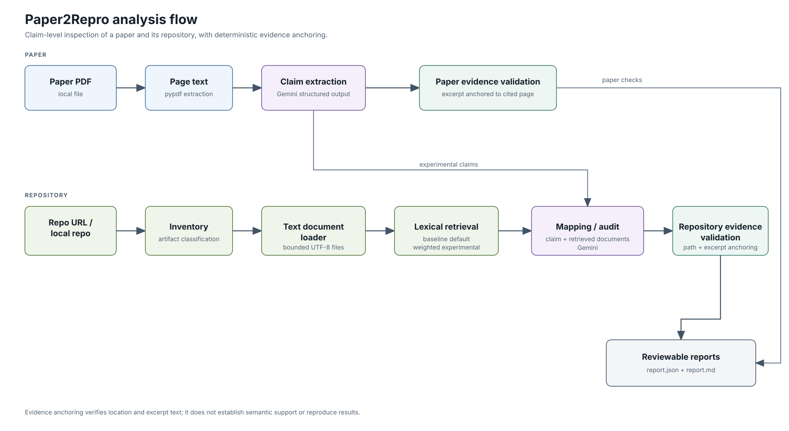

# Paper2Repro

**Paper2Repro inspects whether an ML paper's experimental claims can be traced to evidence in the paper and its repository.** It produces a claim-by-claim report; it does not reproduce experimental results.

It is a small research and development prototype for connecting paper claims with repository artifacts such as READMEs, configs, scripts, and environment files.

- Extracts experimental claims and page excerpts from selectable PDF text.
- Checks whether each paper excerpt appears on its cited page.
- Retrieves repository text with a baseline lexical retriever or an experimental weighted retriever.
- Uses Gemini to draft repository mappings and a seven-item reproducibility checklist.
- Checks cited repository paths and excerpts, then writes `report.json` and `report.md`.
- Can reuse claims from a saved report to compare retrievers without repeating claim extraction.

[日本語の概要](docs/OVERVIEW_JA.md)

## Why this project?

Information needed to reproduce one ML result is often spread across the paper, README, configs, scripts, checkpoints, and environment files. A repository-wide summary can obscure which artifact relates to a particular reported result. Paper2Repro uses the experimental claim as its unit of analysis and keeps paper and repository references visible for review.

## What it does

Paper2Repro parses a PDF into page-numbered text, extracts claims, retrieves candidate repository documents, and asks Gemini to map each claim to repository evidence. The report includes paper evidence checks, repository evidence checks, and checks for data preparation, model/config, checkpoint, commands, environment, random seed, and evaluation protocol.

## What it does not do

Paper2Repro does not run training, inference, evaluation, or arbitrary repository commands. It does not establish that a quoted passage semantically supports a claim, that a result is reproducible, or that a repository URL is the paper's official repository. It has no OCR and no human-reviewed multi-paper evaluation set.

## What makes this different?

- The unit of analysis is an experimental claim, rather than a whole paper or a whole repository.
- Paper excerpts are checked against their cited PDF page. Repository citations are checked against retrieved paths and text excerpts.
- Each claim gets a compact checklist of reproducibility information to inspect.
- `NOT_FOUND` is scoped to retrieved and inspected documents; it does not imply repository-wide absence.

The deterministic checks establish that cited locations and excerpts can be anchored. They do not establish semantic support. Gemini performs claim extraction and repository classification; deterministic code checks the cited evidence after those steps.

## Architecture



## Quickstart

Requires Python 3.11+, Git, and [uv](https://docs.astral.sh/uv/).

Install dependencies and provide a Gemini API key through the environment:

```bash
uv sync
export PAPER2REPRO_API_KEY="your-gemini-api-key"
# Optional; defaults to gemini-3.8-flash.
export PAPER2REPRO_MODEL="gemini-3.8-flash"
```

`.env.example` documents the settings. `.env` is ignored by Git and is not loaded automatically.

Analyze a local PDF against a local repository or public GitHub URL:

```bash
uv run python scripts/analyze.py \
  --paper local_data/soccermaster.pdf \
  --repo https://github.com/haolinyang-hlyang/SoccerMaster \
  --output outputs/soccermaster
```

The baseline retriever is the default. The run writes:

- `outputs/soccermaster/report.json` — structured analysis data
- `outputs/soccermaster/report.md` — review-oriented summary

### Compare retrievers with the same claims

To keep the claim set fixed, reuse claims from a prior report. The supplied PDF is still parsed, and paper evidence is revalidated against its current page text; only claim extraction is skipped.

```bash
uv run python scripts/analyze.py \
  --paper local_data/soccermaster.pdf \
  --repo https://github.com/haolinyang-hlyang/SoccerMaster \
  --retriever weighted \
  --reuse-claims-from outputs/soccermaster/report.json
```

The weighted retriever is experimental. The report records the retriever, `claim_source`, and the reused report path. Mapping still uses Gemini, so this mode saves the claim-extraction call rather than all API calls.

### Inspect retrieval offline

The debug CLI reads an existing report and a local repository; it does not call an LLM. Compare the baseline and weighted rankings for selected claims with:

```bash
uv run python scripts/debug_retrieval.py \
  --report outputs/soccermaster/report.json \
  --repo /path/to/SoccerMaster \
  --compare \
  --claims 2,4,8,9 \
  --top-k 5
```

Use `--retriever baseline` or `--retriever weighted` to inspect one ranking. Weighted results show matched terms and score contributions.

## Example report layout

The following is a **schematic** excerpt; bracketed values are placeholders, not measured results.

```markdown
## Summary

| # | Claim | Dataset | Metric / value | Paper evidence | Mapping |
|---:|---|---|---|---:|---|
| 1 | [claim statement] | [dataset] | [metric, value] | [valid/total] | [status] |

## Claim 1

### Paper evidence
- **[VALID or INVALID]**, page [page]: “[short excerpt]”

### Retrieved repository documents
- `path/to/config.yaml`

### Claim to repository mapping
- Status: **[status]**

### Reproduction checklist
- **model_config: [PRESENT / AMBIGUOUS / NOT_FOUND]**
```

`SUPPORTED` means the mapping returned repository evidence that could be anchored to a retrieved document. It is not a claim that the result was reproduced or independently verified.

## Retrieval and validation

The default `baseline` scores literal matches for the claim's dataset, metric, and reported value against each document's path and content. It does not use the claim statement. The experimental `weighted` retriever also scores statement terms and gives additional weight to dataset, metric, reported value, and path matches. Select it with `--retriever weighted`; the baseline remains the default.

In one offline SoccerMaster development comparison, baseline retrieval returned no documents for Claims 4 and 8. Weighted retrieval ranked `codes/SoccerMaster/models/video_caption.py` first for Claim 4 and `codes/SoccerMaster/data/video_caption.py` first for Claim 8. These are candidate-ranking observations from one repository and run, not accuracy measurements or a formal evaluation. Baseline also returned repeated unrelated candidates for Claims 2 and 9. See the [retrieval analysis](docs/SOCCERMASTER_RETRIEVAL_ANALYSIS.md) for the failure analysis and review caveats.

One saved end-to-end development run extracted 9 claims, anchored 21/21 paper evidence excerpts to their cited pages, produced at least partial repository mappings for 4/9 claims, inventoried 740 artifacts, and loaded 621 text documents. These are outputs from one run, not general quality scores. Mapping statuses are model output, not comparison with gold labels.

Paper evidence normalization applies Unicode NFKC, removes invisible format characters, repairs line-break hyphenation, and collapses whitespace. If ordinary normalized substring matching fails, validation also tries a whitespace-insensitive comparison. It does not use edit distance, embeddings, or semantic entailment; different numbers and punctuation remain significant. In one SoccerMaster run, evidence quoted for page 8 appeared in extracted text on page 9 and was marked invalid. The validator does not search neighboring pages to hide a citation mismatch.

Repository documents are loaded as bounded UTF-8 text. Binary, excluded/generated, and files larger than 256 KB are skipped. Repository evidence is checked against the retrieved documents. The seven checklist statuses are `PRESENT`, `AMBIGUOUS`, and `NOT_FOUND`; `NOT_FOUND` only describes the retrieved and inspected set.

## Other entry points

To inspect claims in a PDF without providing a repository:

```bash
uv run python scripts/analyze_pdf_claims.py path/to/paper.pdf
```

The local API has `GET /health` and a synchronous `POST /analysis` endpoint for paths accessible to the server:

```json
{
  "paper_path": "local_data/soccermaster.pdf",
  "repository": "https://github.com/haolinyang-hlyang/SoccerMaster",
  "output_dir": "outputs/api-run",
  "top_k": 5
}
```

The API does not implement uploads, background jobs, authentication, or run history. Start it with:

```bash
uv run uvicorn paper2repro.api:app --reload
```

## Development

Run the test suite without making real Gemini calls:

```bash
uv run pytest
```

CI runs pytest and builds the Docker image. A synthetic Gemini smoke script is also available; it skips if no API key is configured:

```bash
uv run python scripts/manual_gemini_claim_extraction.py
```

Build and run the API container with:

```bash
docker build -t paper2repro .
docker run --rm -p 8000:8000 -e PAPER2REPRO_API_KEY paper2repro
```

Successful structured responses are cached in `.paper2repro_cache/`, which is ignored by Git. Cache files may include paper claims and repository excerpts; keep them local. Use `--cache-dir PATH` to choose another location or `--no-cache` to disable caching. `--max-llm-calls N` optionally caps provider calls. The Gemini SDK makes one attempt per request and does not automatically retry. Prompt/response character counts and provider-reported token counts are shown separately.

## Limitations and next steps

- OCR is not implemented; scanned PDFs may yield little or no text.
- Claim extraction and semantic mapping depend on Gemini and can vary across runs.
- Evidence anchoring checks page/path/excerpt presence, not semantic entailment.
- Lexical retrieval can miss relevant files or return unrelated candidates. Weighted retrieval is experimental and does not yet have a human-reviewed evaluation.
- Large configs, generated files, checkpoints, datasets, and binary artifacts are not inspected as document content.
- Retrieved repository text is sent to the configured Gemini provider. Only analyze repository content that is safe to share with it.
- No training, inference, arbitrary repository commands, GPU jobs, or LLM-based judging are performed.

Planned work includes a human-reviewed multi-paper evaluation set, measured comparison with BM25 or embedding retrieval, better document segmentation and line locations, and controlled execution as a separate later capability.

## Project structure

- `claims/`: claim extraction and paper evidence validation
- `repo/`: inventory, text loading, source resolution, and repository evidence validation
- `retrieval/keyword.py`: baseline and experimental weighted lexical retrieval
- `mapping/`: claim-to-repository assessment and audit grounding
- `pipeline.py`: end-to-end orchestration
- `report.py`: JSON and Markdown output
- `scripts/`: end-to-end and focused manual entry points
- `tests/`: unit and mocked integration coverage
- `docs/`: Japanese overview, learning notes, and retrieval analysis
