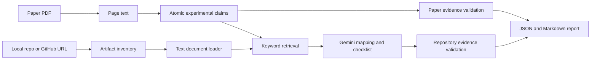

# Paper2Repro

Paper2Repro is a small research prototype for claim-level, evidence-grounded reproducibility auditing of machine learning papers and their official repositories.

It extracts the main quantitative results from a paper, checks that every paper quote exists on the cited PDF page, retrieves relevant repository files, maps each claim to repository evidence, and produces a structured reproduction checklist. It generates `report.json` and `report.md`; it does not run training or claim that a reported result has been reproduced.

## Why this problem?

The information needed to reproduce one result is often split across the paper, README, configs, scripts, checkpoints, and environment files. Repository-level summaries can hide which artifact supports which reported number. Paper2Repro keeps the experimental claim as the unit of analysis and preserves the path from every conclusion back to quoted evidence.

Compared with systems focused on executing repositories, Paper2Repro currently focuses on inspecting whether reproducibility information is present and traceable. Compared with general retrieval-augmented generation, it validates every cited page, path, and excerpt with deterministic code before presenting it as grounded evidence.

## Core idea



The LLM performs bounded extraction and semantic classification. Deterministic code handles page existence, path existence, and verbatim excerpt anchoring. Invalid evidence stays visible in the report and cannot silently justify a positive status.

## Data flow

1. `parse_pdf()` converts selectable PDF text into page-numbered `PaperChunk` objects.
2. Gemini structured output creates atomic `ExperimentalClaim` objects with paper evidence.
3. Paper excerpts are anchored to the cited page using conservative normalization.
4. A local repository is used directly, or a public GitHub repository is shallow-cloned into a temporary directory.
5. The inventory is converted into bounded UTF-8 `RepoDocument` objects. Binary, generated, cached, and files larger than 256 KB are skipped to bound memory and prompt size.
6. The selected lexical retriever scores repository paths and contents and returns the top `k` candidates. The baseline uses dataset, metric, and reported value; the experimental weighted retriever also scores claim-statement terms.
7. Gemini receives only those retrieved documents and returns a claim mapping plus a seven-item reproduction checklist.
8. Every repository path and excerpt is validated against the retrieved documents. Unsupported positive statuses are downgraded.
9. The pipeline writes the complete structured result to JSON and a review-oriented Markdown report.

## Reproduction checklist

Each claim is checked for:

- dataset or data preparation
- model or configuration
- checkpoint
- training or inference command
- environment or dependencies
- random seed
- evaluation protocol or metric

Statuses are `PRESENT`, `AMBIGUOUS`, and `NOT_FOUND`. `NOT_FOUND` means the information was not found in the inspected retrieved artifacts; it does not prove that the information is absent from the entire repository.

## Why deterministic validation?

Structured output controls shape, but it does not guarantee that an excerpt or location is real. Paper2Repro therefore rejects a paper excerpt when the cited page does not contain it and rejects repository evidence when the retrieved path or excerpt cannot be found.

In a SoccerMaster development run, Gemini cited PDF page 8 for camera-calibration evidence whose extracted sentence appeared on page 9. The validator marked it invalid. The check deliberately did not search nearby pages, because doing so would hide an incorrect citation.

Validation normalizes Unicode, removes invisible format characters, repairs line-break hyphenation, and tolerates whitespace extraction errors. It does not use edit distance, embeddings, or semantic entailment; different numbers and punctuation remain different evidence.

## Why keyword retrieval first?

The default `baseline` retriever is an intentionally simple lexical baseline. It matches only the claim's dataset, metric, and reported value against each `path + content`; it does not use the claim statement. The `weighted` retriever is an experimental alternative that adds statement terms and gives extra weight to dataset, metric, reported value, and path matches. It can be selected with `--retriever weighted`; the default remains `baseline`.

The weighted version was added after the baseline returned no candidates for Claims 4 and 8 in one SoccerMaster development run. In an offline development comparison, Claim 4's weighted top result was `video_caption.py` (baseline returned zero documents), and Claim 8's weighted top result was `data/video_caption.py` (baseline returned zero documents). These are observations from one repository and run, not accuracy results or a formal evaluation. In that same run, the tool extracted 9 claims, anchored 21/21 paper evidence excerpts to their cited page, mapped 4/9 claims to at least partial repository information, and inspected 740 artifacts / 621 text documents. These are outputs from one run, not accuracy or general quality scores. The baseline also returned repeated unrelated candidates for Claims 2 and 9. Therefore `NOT_FOUND` applies only to retrieved and inspected files, and does not mean repository-wide absence. See [retrieval analysis](docs/SOCCERMASTER_RETRIEVAL_ANALYSIS.md).

## Setup

Requires Python 3.11+, Git, and [uv](https://docs.astral.sh/uv/).

```bash
uv sync
export PAPER2REPRO_API_KEY="your-gemini-api-key"
# Optional; defaults to gemini-3.8-flash.
export PAPER2REPRO_MODEL="gemini-3.8-flash"
```

`.env.example` documents the variables. `.env` is ignored and is not loaded automatically.

## End-to-end CLI

Analyze a local PDF with either a local repository path or a public GitHub URL:

```bash
uv run python scripts/analyze.py \
  --paper local_data/soccermaster.pdf \
  --repo https://github.com/haolinyang-hlyang/SoccerMaster \
  --output outputs/soccermaster
```

This uses the `baseline` retriever by default. To try the experimental weighted
retriever, add `--retriever weighted`; the selected retriever is recorded in
`report.json` and `report.md`.

To compare retrievers with a fixed claim set, reuse claims from an existing
analysis report. Paper2Repro still parses the supplied PDF and revalidates every
paper evidence excerpt against that PDF, while skipping claim extraction:

```bash
uv run python scripts/analyze.py \
  --paper local_data/soccermaster.pdf \
  --repo https://github.com/haolinyang-hlyang/SoccerMaster \
  --retriever weighted \
  --reuse-claims-from outputs/soccermaster/report.json
```

The output records `claim_source: reused_report` and the source report path.

The CLI prints claim, evidence, mapping, and checklist counts and writes:

- `outputs/soccermaster/report.json`
- `outputs/soccermaster/report.md`

The CLI also prints stage timing and LLM request measurements. Prompt/response character counts are text lengths, not token or billing counts. Successful structured responses are cached in the gitignored `.paper2repro_cache/` directory so a later run can resume after a provider error. Cache JSON may include paper claims and repository excerpts, so keep it local. Use `--cache-dir PATH` to choose another location or `--no-cache` to disable it. `--max-llm-calls N` optionally blocks the next provider request after N calls; without the flag, there is no call cap. The Gemini SDK is configured for one attempt per request, with no automatic retries.

To inspect retrieval from an existing JSON report without calling an LLM:

```bash
uv run python scripts/debug_retrieval.py \
  --report outputs/soccermaster/report.json \
  --repo /path/to/SoccerMaster \
  --top-k 5
```

The debug CLI uses the baseline by default. To compare both rankings for the
claims that need closer review, use:

```bash
uv run python scripts/debug_retrieval.py \
  --report outputs/soccermaster/report.json \
  --repo /path/to/SoccerMaster \
  --compare \
  --claims 2,4,8,9 \
  --top-k 5
```

Use `--retriever baseline` or `--retriever weighted` to inspect one ranking.
The weighted output includes matched terms and their score contributions.
This is a local lexical comparison; it does not change the pipeline's default
retriever or call an LLM.

New Markdown reports start with a claim summary table and include counts for paper evidence, mapping statuses, and the seven-item audit. For a claim with no retrieved documents, its `NOT_FOUND` items explicitly refer to an empty inspected set.

PDFs and `outputs/` are ignored by Git. To inspect paper claims without a repository, use:

```bash
uv run python scripts/analyze_pdf_claims.py path/to/paper.pdf
```

The synthetic Gemini smoke script skips cleanly when no API key is set:

```bash
uv run python scripts/manual_gemini_claim_extraction.py
```

## API

Run the local server:

```bash
uv run uvicorn paper2repro.api:app --reload
```

`GET /health` returns `{"status": "ok"}`. `POST /analysis` runs the same synchronous pipeline for paths accessible to the server:

```json
{
  "paper_path": "local_data/soccermaster.pdf",
  "repository": "https://github.com/haolinyang-hlyang/SoccerMaster",
  "output_dir": "outputs/api-run",
  "top_k": 5
}
```

The API is a local prototype. It does not implement uploads, background jobs, authentication, or run history.

## Evaluation

`evals/` contains a human-review template and metric definitions for claim precision/recall, paper evidence validity, retrieval Recall@k, repository evidence validity, and audit agreement. The repository does not label LLM output as gold data. Reliable scores require human annotations across multiple paper/repository pairs.

## Project structure

- `claims/`: atomic claim prompting, extraction, and paper evidence validation
- `repo/`: repository inventory, bounded text loading, source resolution, and evidence validation
- `retrieval/keyword.py`: inspectable lexical retrieval baseline
- `mapping/`: claim-to-repository assessment and audit grounding
- `pipeline.py`: end-to-end orchestration
- `report.py`: structured JSON and Markdown output
- `api.py`: minimal FastAPI wrapper around the pipeline
- `scripts/`: end-to-end and focused manual entry points
- `tests/`: unit and mocked integration coverage without real Gemini calls
- `docs/`: Japanese learning/application notes plus performance and retrieval analysis

## Tests and Docker

```bash
uv run pytest
docker build -t paper2repro .
docker run --rm -p 8000:8000 -e PAPER2REPRO_API_KEY paper2repro
```

GitHub Actions runs pytest and builds the Docker image. CI never calls the live Gemini API.

## Limitations

- OCR is not implemented; scanned PDFs may yield empty text.
- Claim extraction and semantic mapping depend on Gemini and may vary across runs.
- Evidence anchoring checks location and verbatim text after conservative normalization, not semantic support.
- Keyword retrieval can miss relevant files that do not repeat the dataset, metric, or value.
- The saved SoccerMaster counts describe one development run only; there is not yet a human-reviewed multi-paper evaluation set.
- Only small UTF-8 text artifacts are loaded. Large configs, generated files, checkpoints, datasets, and binary artifacts are not inspected as document content.
- Retrieved repository text is sent to Gemini. Analyze only repositories whose selected text is safe to share with the configured API provider.
- A `SUPPORTED` mapping means relevant repository evidence was found. It does not mean the claim was experimentally reproduced.
- No training, inference, arbitrary repository commands, GPU jobs, or LLM-based judging are performed.

## Future work

- Build and human-review a multi-paper evaluation set.
- Compare the lexical baseline with BM25 and embedding retrieval after measuring failure modes.
- Add better document segmentation and line locations while keeping evidence validation deterministic.
- Add asynchronous API jobs and persisted run metadata if real usage requires them.
- Separate artifact availability from executable reproducibility through controlled execution in a later version.
